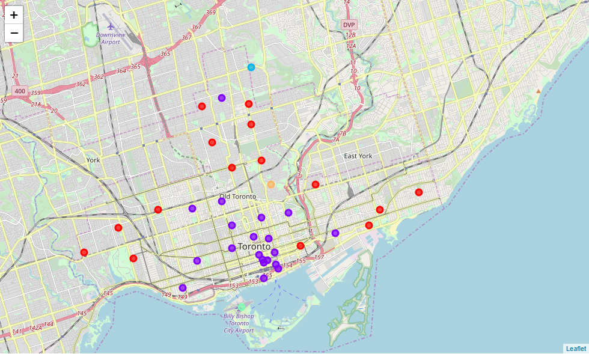

# Coursera-Capstone

This is a final capstone project for a data science coursera course.  It is the ninth and final course before obtaining: a *Data Science Professional Certification from IBM & Coursera*. 

### Problem Summary:
Can we predict a Toronto apartment's rental price by knowing the businesses around it? This capstone is an exploration to see what effect businesses have on nearby apartment prices, and to try and determine the trends that lead to more expensive or desirable living space. If we know that certain businesses impact the price of an apartment when they open nearby, we can locate businesses that are more valuable to people. It can help land developers and business owners better forecast how new businesses can have an impact on rent prices in neighborhoods.

### Data Description:
The data used will be a combination of one dataset, and data from API calls. The primary dataset is compromised of Toronto apartment rental prices for 2018. The dataset contains the price, address, latitude, longitude, and rooms of 1124 apartments for rent in the Toronto area. This dataset is publicly available on Kaggle [here](https://www.kaggle.com/rajacsp/toronto-apartment-price). The Latitude, Longitude values in the dataset will be used with the Foursquare API to find the nearby businesses to each apartment.

## The capstone project:
- [Capstone Report](Capstone%20Report.md)
- [Capstone Code](Capstone%20Project.ipynb)

## These notebooks contain other project assignments:

### Hello World Notebook
- [hello world](./hello_world.ipynb)

### K-Means Clustering Toronto Neighborhoods based on their Most Common Restaurant and Store Types

- [Clustering and Segmenting Toronto Neighborhoods](./Clustering%20and%20Segmenting%20Toronto%20Neighborhoods.ipynb)
